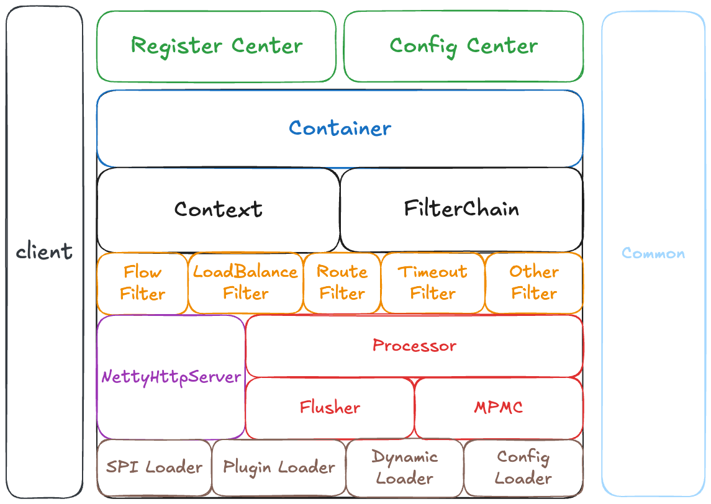

# 自研高性能网关项目的开发文档  
整个项目在整个开发过程中的思考和实现
# 为什么会出现Gateway这个项目？  
成熟的框架开发的好处在于其支持快速整合和部署，并且由于其经过了长时间的市场检验，稳定性也能得到一定的保证。但是虽然人家开放了源码给你阅读，但是遇到问题的时候也就意味着你只能花时间从头去了解和排查问题，这就在一定程度上增加了我使用它的成本，他虽然表面看上去是一个透明的箱子，但是在我使用他的时候，只要遇到了问题，我依旧需要将我的手伸进去去触及那些我未曾了解的细节。并且，成熟稳定可能也就意味着考虑过多，过多的将一些当前项目所不需要的功能整合进系统，导致系统过度冗余，那么此时，我们肯定是希望能基于自己的需求开发出一个适应自己需求的网关的。因此Gateway也就应运而生了。  
# 为什么需要自研网关？  
其实我认为思考问题一个很好的方式是从反方向去思考，我可以先列举出直接使用成熟框架的好处，那么它的好处的反方向就是他的缺点。也就是设计自研网关的必要性。所以我当初思考了几个开源框架的好处，然后从侧面思考，就能思考出其缺点。  
1. **稳定性**:  
   - **优点**: 稳定性意味着可靠的行为和预期的输出。  
   - **缺点**: 过度的稳定性可能导致在特定场景下缺乏灵活性，使得实现特定功能变得复杂或效率降低。  
2. **社区支持**:  
   - **优点**: 丰富的社区资源和文档。  
   - **缺点**: 过度依赖社区支持可能会在需要快速解决或定制问题时，受限于社区的响应速度和可用的专业知识。  
3. **快速开发**:  
   - **优点**: 现成的功能和简单的配置可以加速开发。  
   - **缺点**: 为了通用性而设计的功能可能不适合所有的用例，可能会导致性能不是最优化的，或者需要做额外的工作来适配特定需求。  
4. **集成能力**:  
   - **优点**: 与广泛的其他服务和组件有良好的集成。  
   - **缺点**: 这种集成可能会限制新技术的采用，因为新技术可能不兼容或未经优化。  
5. **成本效益**:  
   - **优点**: 可以节约初期的资源投入。  
   - **缺点**: 随着时间推移，可能需要投入更多的资源去学习、调整和扩展开源网关以满足特定需求，这可能会抵消初期的节省。  
  
从简单且更加片面的角度去看，自研网关的好处有如下几点：  
  
1. **完全控制**: 自研网关意味着拥有对网关功能的全面控制，团队可以根据具体业务需求定制网关行为，不受外部项目的限制。这包括路由决策、安全性检查、流量控制和日志记录等。  
2. **定制的性能优化**: 可以针对特定的用例和环境进行性能调优。例如，如果某个服务需要非常高的吞吐量或极低的延迟，团队可以优化代码和配置来满足这些特定的性能要求。  
3. **特色功能**: 在内部网关中实现独特的业务逻辑和集成，例如，自定义认证/授权机制，特殊的转换逻辑，或者与内部系统的特殊集成。  
4. **减少依赖**: 自研网关减少了对外部开源项目维护速度和方向的依赖，这在某些情况下可能避免了被迫跟随外部变化带来的风险。  
  
从更加高维的视角去看，为什么需要一个自研网关？  
  
1. **成本考虑**: 成熟的网关产品在未来可能会引入不兼容的更改或弃用特定特性，导致企业不得不进行昂贵的迁移或重构。自研网关则完全控制版本和功能迭代，避免了这种风险。  
2. **技术因素**: 对于使用非HTTP协议（如TCP、UDP直连或专有协议等）的老旧系统，市面上的网关产品往往只提供有限或无支持。自研网关可以确保与这些系统的兼容性，证据在于许多遗留系统的成功集成案例，例如金融行业中特有的交易协议。  
3. **网络和安全性能**: 在对网络延迟极为敏感的交易系统中，即使是毫秒级的改进也具有重大意义。自研网关可以针对特定的网络环境和数据流模式进行优化，有的金融机构通过内部开发的网关减少了30%的网络延迟。  
4. **组织和运营**: 自研网关的更新和迭代可以与企业的CI/CD流程紧密集成，这为企业带来了更高的敏捷性和响应市场变化的能力。在许多成功案例中，企业能够在几小时内部署网关更新以支持新的市场需求或应对安全威胁，而不是等待第三方发布更新。  
5. **市场和竞争优势**: 通过自研网关提供的独特服务或功能，企业可以在市场上建立独特的卖点。例如，Amazon的API Gateway提供了与AWS服务的深度集成，这是它们的一个关键竞争优势。  
6. **创新驱动**: 自研网关允许企业实现最新的技术研究成果，而无需等待这些功能在开源项目中可用。例如，谷歌的ESPv2 API网关就是在开源的Envoy基础上，集成了谷歌特有的安全、监控和控制策略。  

其实，上面说的都太高大上了，从个人角度的层面来说的话，一个自研网关的作用难道不是，在自研项目的过程中，增加你对架构设计，语言特性以及你的知识面嘛。
# 了解他人，认识自己  
所谓知己知彼百战不殆（哈哈哈我想这个地方不应该用这句话）。
我的意思是，在你设计一个项目之前你肯定需要去分析设计这个项目在市场上的已经存在的项目中，和他们去做区分，了解各个项目的优缺点，然后提炼出你自己设计这个项目的一个设计方向。
所以我调查了市面上已有的且比较知名的网关项目，列举出了如下这张优缺点表格。  
  
| **Gateway名称**           | **优点**                               | **缺点**                              | **设计侧重点**           |     |
| ----------------------- | ------------------------------------ | ----------------------------------- | ------------------- | --- |
| **Nginx**               | **高性能，配置灵活，轻量级，高稳定性**                | **模块化程度低，扩展性差，异步处理能力受限**            | **高性能HTTP服务器和反向代理** |     |
| **Apache HTTP Server**  | **模块丰富，社区活跃，跨平台，文档齐全**               | **性能较差，配置复杂，更重量级**                  | **多功能Web服务器，重视模块化** |     |
| **HAProxy**             | **高性能，支持TCP和HTTP代理，稳定且成熟**           | **配置不如Nginx直观，缺乏现代Web界面**           | **专注于高并发连接的负载均衡**   |     |
| **Traefik**             | **自动化服务发现和配置，容器和微服务友好，易于部署**         | **社区较新，历史较短**                       | **云原生环境中的动态配置**     |     |
| **Kong**                | **基于Nginx和OpenResty，提供丰富的插件，管理界面友好** | **高性能场景可能需优化配置，插件生态不如Apache/Nginx** | **扩展性和插件生态系统**      |     |
| **SpringCloud-gateway** | **适配Spring框架**                       | **强依赖Spring生态，启动时间长**               | **和spring生态契合**     |     |
  
所以，基于上面这些比较成熟且知名度较高的网关，我也提炼出了我自己设计一个网关的侧重点：  
1. **性能与可伸缩性**:  
   - 关注高吞吐量和低延迟处理，以便能够处理大量并发连接和数据流。  
   - 设计可在多个服务器、数据中心或地理区域之间伸缩的解决方案。  
2. **安全性**:  
   - 实现高级安全特性，如SSL/TLS终止、OAuth、JWT、API密钥验证和防止DDoS攻击等。  
   - 确保所有通过网关的流量都符合最新的安全标准和法规要求。  
3. **可观测性**:  
   - 提供详细的监控和日志记录功能，使运维团队能够观测和诊断问题。  
   - 集成与现有监控工具和警报系统的能力。  
4. **路由能力**:  
   - 开发动态路由和负载均衡策略，以支持微服务架构中服务发现的需求。  
   - 支持基于URL、路径或头部的路由决策。  
5. **扩展性**:  
   - 构建插件架构，使新功能能够以模块化的方式添加。  
   - 保持核心轻量级，允许通过插件或服务集成额外功能。  
6. **多协议支持**:  
   - 考虑支持多种网络协议，不仅限于HTTP/HTTPS，也包括WebSocket、RPC等。  
7. **高可用性**:  
   - 确保网关设计能够容忍单点故障和网络分区，提供故障转移和灾难恢复机制。
好的，那么基于上面我列举出来的这些点之后，我就可以开始分析，我应该如何从这些点入手将一个具体的问题拆解为几个细粒度的解决方法，于是就有了如下的答案：
1. **性能与可伸缩性**:  
   - 使用 **Netty** 进行异步网络编程，Netty 是一个高性能的网络应用程序框架，可以处理大量的并发连接。  
   - **缓存** 如 Caffeine 或 Redis 来减少数据库访问频率，提升性能。  
2. **安全性**:  
   - 集成 **JWT** 用于安全的API访问。  
   - 利用 **TLS/SSL** 加密传输数据。  
3. **可观测性**:  
   - 集成 **Micrometer** 或 **Dropwizard Metrics** 来收集和导出性能指标。  
   - 使用 **ELK Stack**（Elasticsearch, Logstash, Kibana）来收集和分析日志数据。
   - 利用 **Prometheus** 和 **Grafana** 进行监控和警报。  
1. **路由能力**:
   - 利用 **Zuul** 或自定义的 **Servlet Filters** 进行动态路由。
   - 结合 **Consul** 或 **Eureka** 或 **Nacos** 进行服务发现和注册。
1. **扩展性**:
   - 设计插件架构，使得可以通过 **Java SPI (Service Provider Interface)** 加载新模块。
1. **多协议支持**:  
   - **使用 gRPC/Dubbo 来支持RPC调用。**  
   - 支持 **WebSocket** 用于双向通信，使用Java的 **JSR 356** 或 **Spring Framework** 的WebSocket API。  
7. **高可用性:**  
   - **使用 Nacos /  ZooKeeper / etcd 来管理网关的配置信息和服务元数据，以支持高可用部署。**  
  
好的，那么其实基于上面的分析，我们就已经可以大致的得到我们设计一个网关所需要的一些技术上的方向了，接下来的就是确定这些技术，并且确定自己设计该网关时的一个架构图了。  
<a name="yvjHG"></a>  
# 追本溯源：什么是网关？  
现在来一手峰回路转，在上面一节中我们已经分析出来了设计要点，定了一个大概的设计方向，那么接下来我们想要真的开始设计，就得了解一个最最最基本的知识，就是网关，到底是什么？他的作用是什么？以及，接收到一个请求之后，他是如何对请求进行处理的呢？如何进行所谓的负载均衡和请求转发的呢？
所以，我们先Google一下网关的定义和概念，就有了如下内容：
[什么是网关，以及网关的作用是什么？](https://zhuanlan.zhihu.com/p/165142303)  
> 网关(Gateway)又称网间连接器、协议转换器。网关在**传输层**上以实现网络互连，是最复杂的网络互连设备，仅用于两个**高层协议不同的**网络互连。网关的结构也和路由器类似，**不同的是互连层**。网关既可以用于广域网互连，也可以用于局域网互连。 网关是一种充当**转换**重任的计算机系统或设备。在使用不同的通信协议、数据格式或语言，甚至体系结构完全不同的两种系统之间，网关是一个**翻译器**。与网桥只是简单地传达信息不同，网关对收到的信息要重新打包，以适应目的系统的需求。同时，网关也可以提供**过滤和安全**功能。大多数网关运行在OSI 7层协议的顶层--应用层。  

我们对网关的作用做一个总结，大概就是：
**协议转换、安全鉴权、日志监控、熔断限流、负载均衡 、请求转发**没想到一个小小的网关居然有这么多的作用，这里我们就可以形成对上一节的呼应了，上节列出的七点是否顺利的和这里的七点做了一些关联呢？
而其实我们的一个请求被网关的处理流程，就和上面的流程差不多。
当网关收到客户端的请求时，它通常会执行以下步骤处理该请求：  
1. **请求识别**：解析请求的头部、方法和路径，确定请求的服务和操作。  
2. **安全检查**：应用安全层面的检查，可能包括解密SSL请求、验证API密钥、进行OAuth校验等。  
3. **路由决策**：根据预定的路由规则或服务发现机制决定将请求发送到哪个服务。  
4. **修改请求**：根据需要，修改请求的头部或查询参数，甚至请求体。  
5. **负载均衡**：选择一个或多个目标服务实例，可能基于轮询、最少连接、服务器响应时间或哈希等策略。  
6. **请求转发**：将请求转发到选定的后端服务。  
7. **响应处理**：从后端服务接收响应，可能需要进行转换或重新格式化，然后将其返回给客户端。  
8. **日志记录**：记录请求和响应的详细信息，用于审计和分析。  
所以我们就能很明确的明白了一个网关所需要做的事情，也就明白了我们设计上需要着重考虑的一些点。而这些点就是影响网关功能甚至性能的关键。  
# 架构分析与思考  
## 技术栈选择  
从上一节我们已经了解到一个网关设计过程中所需要考虑到的几乎方方面面的侧重点。那么我们接下来就基于这些侧重点分析如何对这些侧重点进行技术选型，并设计出我们的网关的一个大致的架构。
**性能与可伸缩性：** 参考目前主流的网关的设计，有SpringCloud Gateway以及Zuul，他们的底层都大量使用了异步编程的思想，并且也都有非常重要的网络通信上的设计。
比如我当初看SpringCloudGateway的源码的时候就看到了大量的对Netty的使用。
由于我们的网关是自研的，也就是他自己本身就是一个单独的服务，因此我们并不需要使用到SpringBoot这种框架，我们可以直接使用原生Java框架来编写各种重要代码。
因此网络通信上毋庸置疑的使用Netty即可。
缓存以及高性能这方面，分布式缓存我们使用Redis，本地缓存选择Caffeine，两者都是经过市场考验的成熟缓存框架。并且使用的用户量也更多。
**安全性上：** 我们使用JWT，其优点在于简单的Token格式，便于跨语言和服务传递，适合于微服务和分布式系统的安全性设计。
当然缺点也在于我们需要精细的管理和保护我们的密钥。这里我并不打算支持TLS/SSL，首先是我作为个人开发者，想要去支持TLS/SSL是比较复杂的，并且我还需要管理证书的生命周期，会影响项目开发的进度，因此我并不打算在我的网关中支持TLS/SSL。
**可观测性：**  
- **Micrometer** 和 **Dropwizard Metrics**:  
  - 优点: 两者都是成熟的度量收集框架，提供了丰富的度量集合和报告功能。
  - 缺点: 可能需要适配特定的监控系统或标准。
- **ELK Stack**:  
  - 优点: 提供了一个完整的日志分析解决方案，适用于大规模日志数据的收集、搜索和可视化。
  - 缺点: 组件较多，搭建和维护相对复杂。  
- **Prometheus** 和 **Grafana**:
  - 优点: 高度适合于时序数据监控，Grafana 提供强大的数据可视化。  
  - 缺点: 需要配置和维护Prometheus数据抓取和存储。
这里我选择使用最后一种，因为目前市面上这种用的比较多，我也比较熟悉，我就职过多公司也基本都是这一套。并且Prometheus相对于其他的更加简单易用。
**路由能力/高可用：** 同时，在上文也提到了，网关是需要用到注册中心的，因为我们的请求具体最后要转发到那个路由，是需要从注册中心中拉取服务信息的，目前注册中心有：**Zookeeper，Eureka，Nacos，Apollo，etcd，Consul**
他们各有优劣势，比如Zk保证的是CP而不是AP，我们知道，网关是应用的第一道门户，我们使用Dubbo的时候会使用Zk，但是对于网关，可用性大于一致性，因此Zk我们不选。
而Eureka都和SpringCloud生态有比较紧密的联系，因此如果我们使用它，就会增加我们的网关和SpringCloud的耦合，不太符合我们自研的初衷，所以也不选。
Etcd虽然是通用的键值对分布式存储系统，可以很好的应用于分布式系统，但是依旧没有很好的优势，当然，他很轻量级。所以这里暂不考虑。
Consul和Etcd差不多，所以这里也不考虑Consul。
这里我选用Nacos作为注册中心，Nacos首先支持CP和AP协议，并且提供了很好的控制台方便我对服务进行管理。同时，Nacos的社区相对来说非常活跃，网络上的资料也更加的多，同时，我也看过Nacos的源码，编写优雅且相对易懂。同时我相信会使用Nacos的人肯定更多，因此在这里选择Nacos作为注册中心。

当然，上面的几种注册中心都可以使用，没有特别明显的优劣势，他们也都有各自合适的场合，具体场合具体分析，主要是要分析自己的团队更加了解或者适合哪一种注册中心。
而配置中心方面，有SpringCloud Config，Apollo，Nacos。
这里很明显，依旧选择Nacos，因为Nacos不仅仅是注册中心也是配置中心。因此选用Nacos我们可以减少引入不必要的第三方组件。
**多协议支持：** 可以考虑的有gRPC和Dubbo，gRPC支持多种语言，并且基于HTTP/2.0，Dubbo在Alibaba使用的比较多，并且比较适合Java的生态。同时gRPC的使用要求熟悉Protobuf，所以这里为了减少成本，考虑使用Dubbo。
**熔断降级限流**：这里可以考虑的有两个框架，分别是**Resilience4j** 和 **Hystrix**
这两个框架都可以实现对应的功能，但他们以下几个主要的区别
1. **维护与更新**：Hystrix已经在2018年停止更新了，但是Resilience4j还在活跃的更新。
2. **兼容性**：Resilience4j可以兼容很多新技术和新语法，由于Hystrix已经停止更新了，很多语法不支持，包括使用一些较新的版本的时候可能会出现冲突
3. **集成难度**：Hystrix配置较为复杂，且很多功能（如熔断、线程池、回退等）都需要单独的设置和配置，而Resilience4j供 **模块化的设计**，每个容错功能（熔断、限流、重试、缓存等）都是独立的模块，可以根据需要自由选择引入需要的功能。
4. **性能和资源消耗**：Resilience4j更加轻量级，高并发高吞吐量场景下，资源消耗较少，而Hytrix较为重量级，默认通过线程池来进行资源隔离。在高并发情况下，如果线程池配置不当，可能会导致资源浪费或性能瓶颈。
所以，经过一套分析，我们就可以得出如下的主要技术栈：    
5. **开发语言：Java 17**
6. **网络通信框架：Netty 4.1.51**
7. **缓存：Redis、Caffeine 版本不限**  
8. **注册中心与配置中心：Naccos 3.0.x**
9. **RPC协议：Dubbo 2.7.x**  
10. **日志监控：Prometheus、Grafana 版本不限**  
11. **安全鉴权：JWT 版本不限**
12. **熔断降级限流：Resilience4j 2.2.0**
## 项目架构  
基于技术栈的分析完毕之后，我们就可以开始考虑如何对项目的架构进行设计了，思考每个服务的实现方式，比如我们的网关如何处理每一个请求？走的是过滤器对吗？我们的网关如何进行请求转发？需要先从注册中心拿到服务实例对吗？我们需要一个实体类来代表我们的请求和响应对吗？我们需要用到什么机制来动态的加载我们的配置？我们需要如何判定什么时候需要加载什么类？什么时候什么路径下某个过滤器才会生效？<br />这些都是我们需要考虑的，所以，我们画出如下架构图：

Common：维护公共代码，比如枚举
Client：客户端模块，方便我们其他模块接入网关
Register Center：注册中心模块
Config Center：配置中心模块
Container：包含核心功能
Context：请求上下文，规则
FilterChain：通过责任链模式，链式执行过滤器
FlowFilter：流控过滤器
LoadBalanceFilter：负载均衡过滤器
RouterFilter：路由过滤器
TimeoutFilter：超时过滤器
OtherFilter：其他过滤器
NettyHttpServer：接收外部请求并在内部进行流转
Processor：后台请求处理
Flusher：性能优化
MPMC：性能优化
SPI Loader：扩展加载器
Plugin Loader：插件加载器
Dynamic Loader：动态配置加载器
Config Loader：静态配置加载器  
## 处理流程  
根据上面的分析，我们可以得到如下的一个处理流程。
  
# 项目骨架的搭建  
在上一节中已经设定好了大致的网关架构所需要用到的一些服务，比如Common、Register Center、Config Center、Client、Core等模块，那么我们就按照这样子框架先搭建出来一个项目骨架
搭建完毕之后，项目骨架如下：
- [ ] 随着不断开发，骨架可能会不断的更新，所以我们会定期更新这里的图片

经过上一章节的讲解，我想只需要根据我们的目录名称就可以大概知道这些目录的作用。
但是我还是打算介绍一下这些目录。  
- Common：网关通用模块包，存放通用配置以及一些工具类。
- ConfigCenter：网关配置中心，当前包提供基于Nacos服务的配置中心的功能，负责从配置中心拉取对应的配置。 
- RegisterCenter：网关注册中心，用于将网关服务注册到基于Nacos的注册中心。
- Core：网关核心模块，网关的几乎所有功能以及网关的启动都依赖于这个模块，包含了过滤器、启动容器、Netty网络处理框架等核心代码。
- Bootstrap：启动器，在网关核心功能实现完毕以后，构建整个网关的启动流程，并且添加一些钩子给使用者使用，丰富网关的生命周期，到时候只需要引用bootstrap就可以启动网关
- Demo：到时候在这个包中启动网关
- SpringApplication：在这其中启动一个正常的后端服务看看能不能正常的对后端服务提供功能。
- Config：进行整个项目的配置管理，原来想直接聚合到core模块中的，但是由于涉及到的配置太多了，打算用一个新的模块来存放。
# 前置知识  
## ServiceLoader  
由于我的项目不是基于Spring实现的网关，那么也就意味着我需要手动的进行一些类的加载，那么这个时候时候我就需要一种机制，它可以帮助我按照我的配置来加载一些我需要的类，就有点类似于SpringBoot的spring.factory自动配置文件，通过扫描这个配置文件中的信息来动态的加载我项目所需要的类。
这里我是用的就是ServiceLoader了。（这里的学习我还是第一次完成动态线程池项目的时候接触到并且学习的，可以实现一些类的加载，也就是我们常说的SPI机制）
具体的ServiceLoader的用法比较简单，这里就简单描述一下：
在你需要用到某些你需要加载的类的时候，比如我需要加载过滤器，那么我就给出这个过滤器的类信息。然后再我们的resource目录下，创建META-INF/services目录。
目录下创建文件，文件名称为你需要加载的接口的全类名。
文件中包含的就是该接口实现类的全类名，如下：
```java
ServiceLoader<Filter> serviceLoader = ServiceLoader.load(Filter.class);  
```  
- [ ] 目前还没有开始写代码，可以在这里放我以前的实现截图，直接从gitee上截图了


可以根据我这两个截图配合文字了解一下SPI的用法
## 熔断、限流、服务降级的区别  
熔断、限流和服务降级是微服务架构中常用的三种弹性设计模式，它们虽然都旨在提高系统的稳定性和可靠性，但各自的工作机制和应用场景有所不同。所以这里我们先来了解一下他们的区别。  
1. **熔断 (Circuit Breaking)**:  
   - 熔断器模式的核心思想是防止连锁故障。当系统中的一个组件出现错误，如超时或响应失败，熔断器会“断开”，阻止进一步的调用。  
   - 熔断的目的是给予故障服务时间进行恢复，同时防止故障扩散到其他服务。  
   - 熔断器通常有几个状态：关闭、打开（熔断）和半开。在半开状态下，熔断器允许有限的调用数通过，以检测故障服务是否恢复正常。  
2. **限流 (Rate Limiting)**:  
   - 限流是控制系统接收的请求数量或者进行的操作数以防止系统过载的过程。  
   - 它确保系统只处理它能够处理的最大请求数量，防止资源耗尽（如内存、带宽或数据库连接）。  
   - 限流可以根据固定的限制，如每秒请求次数（QPS），或动态的限制，如根据系统的当前性能调整。  
3. **服务降级 (Degradation)**:  
   - 服务降级是当系统处于高负载或部分服务不可用时，主动降低某些功能的质量或关闭非核心功能，以保证核心功能的运行。  
   - 这可以通过返回一个简化的或默认的响应来实现，或者关闭一些非关键的服务。  
   - 服务降级的目的是在资源有限的情况下，优先保证关键服务的可用性和稳定性。  
我简单总结一下：
- **熔断**是一种保护机制，当检测到服务失败时，它会暂停服务的调用，以防止故障扩散。  
- **限流**是一种控制机制，用于控制进入系统的流量，以防止系统过载。  
- **服务降级**是一种应对策略，当系统资源紧张时，通过降低服务质量或功能来保持系统的核心部分运行。
有了这些前置知识，我们就可以开始进行具体的设计了。首先是限流，这个是最简单的。  
## JWT
JWT（JSON Web Token）是一种开放标准（RFC 7519），用于在各方之间安全地传输信息作为 JSON 对象。它通常用于在不同系统之间进行身份验证和授权，以及在各种应用中传递声明性信息。
JWT 由三部分组成，它们通过点号（.）分隔：  
- Header（头部）：包含了关于生成的 JWT 的元数据信息，例如算法和令牌类型。  
- Payload（负载）：包含了实际的声明（claim）信息，这些声明是关于实体（通常是用户）和其他数据的信息。有三种类型的声明：注册声明、公共声明和私有声明。  
- Signature（签名）：用于验证JWT的完整性，确保数据在传输过程中没有被篡改。签名是基于头部和负载，使用一个密钥（秘密或公开的）进行加密生成的。
JWT 的作用包括：  
- 身份验证：JWT可用于验证用户身份，确保请求来自经过身份验证的用户。用户登录后，可以生成JWT并将其存储在客户端，然后在后续请求中使用它来证明身份。  
- 授权：JWT可以包含用户的授权信息，以便在服务器端验证用户是否有权限执行某个操作或访问某个资源。  
- 信息交换：JWT可用于在不同系统之间安全地传递信息，例如在微服务架构中进行服务之间的通信。  
本项目中计划使用jjwt实现JWT功能。  
```xml
<dependency>  
  <groupId>io.jsonwebtoken</groupId>  <artifactId>jjwt</artifactId>  <version>0.6.0</version></dependency>  
```  
之后我们编写一个简单的测试用例  
```java
@Test
public void jwt() {
    // 定义一个密钥用于签名 JWT
    String security = "zhangblossom";
    // 创建一个 JWT Token
    String token = Jwts.builder()
            // 设置JWT的主题，通常为用户的唯一标识
            .setSubject("1314520")
            // 设置JWT的签发时间，通常为当前时间
            .setIssuedAt(new Date())
            // 使用HS256算法签名JWT，使用密钥"security"
            .signWith(SignatureAlgorithm.HS256, security)
            // 构建JWT并返回字符串表示
            .compact();

    // 打印生成的JWT Token
    System.out.println(token);
    // 解析JWT Token
    Jwt jwt = Jwts.parser().setSigningKey(security).parse(token);
    // 打印解析后的JWT对象
    System.out.println(jwt);
    // 从JWT中获取主题（Subject）信息
    String subject = ((DefaultClaims) jwt.getBody()).getSubject();
    // 打印JWT中的主题信息
    System.out.println(subject);
}
```  
JWT鉴权的流程图

1. 客户端携带令牌访问资源服务获取资源。
2. 资源服务远程请求认证服务校验令牌的合法性
3. 如果令牌合法资源服务向客户端返回资源。
这里存在一个问题：就是校验令牌需要远程请求认证服务，客户端的每次访问都会远程校验，执行性能低。
如果能够让资源服务自己校验令牌的合法性将省去远程请求认证服务的成本，提高了性能。如下图：
    
牌采用JWT格式即可解决上边的问题，用户认证通过后会得到一个JWT令牌，JWT令牌中已经包括了用户相关的信息，客户端只需要携带JWT访问资源服务，资源服务根据事先约定的算法自行完成令牌校验，无需每次都请求认证服务完成授权。
接下来的代码，我们就要求用户首先请求login用户登录接口，用来得到我们的JWT的token信息，并且我们会将这个token信息写入到我们的请求头中。
之后，当我们请求其他需要使用到token信息的接口的时候，我们就可以从请求头中获取到当前的用户信息了。  
## 灰度发布  
先简单介绍一下什么是灰度发布 

> 灰度发布（Gray Release）是一种软件部署和发布策略，用于逐步将新版本的应用或服务引入生产环境，以降低潜在的风险并确保系统的稳定性。在灰度发布中，新版本的应用或服务不会一次性全部暴露给所有用户，而是逐渐引入一小部分用户，然后根据观察结果决定是否继续推广新版本或回滚到旧版本。这种策略有助于在生产环境中验证新功能、修复潜在问题以及逐渐接受用户反馈。  
>    
> 关键特点和概念：  
>    
> **渐进式发布**：新版本逐渐替代旧版本，从一小部分用户开始，然后逐渐增加新版本的暴露范围。这可以是一个逐步增加百分比的用户，也可以是按照某种规则或条件选择的用户群体。  
>    
> **风险控制**：通过逐渐发布，可以在早期发现和解决潜在问题，从而减轻生产环境中可能发生的故障或问题对整体系统的影响。  
>    
> **用户反馈**：灰度发布过程中，可以收集用户的反馈和性能数据，帮助开发团队更好地了解新版本的行为和性能，以及用户的满意度。  
>    
> **回滚能力**：如果在灰度发布期间发现了严重问题或故障，可以轻松回滚到旧版本，从而减少对用户和业务的负面影响。  
>    
> **分层策略**：通常，灰度发布采用多层级策略，从开发环境到测试环境，再到生产环境，逐渐扩大发布的范围。这确保了新版本在不同环境中都经历了测试和验证。  
>    
> **自动化工具**：灰度发布通常借助自动化工具和部署管道来简化流程，例如使用容器编排工具、部署蓝绿或金丝雀发布等。  
>    
> 灰度发布是现代软件开发和交付的一种最佳实践，它允许组织更加安全和可控地推出新功能，降低风险，提高可维护性，同时减少对用户的影响。这是特别适用于大规模和高可用性系统的策略，以确保系统的连续性和稳定性。  

之后再来介绍一下：**全链路灰度发布**  
  
> 全链路发布是一种软件交付策略，它强调在整个软件开发和交付过程中的每个环节都进行逐步验证和控制，以确保新版本的成功发布并降低风险。全链路发布覆盖了整个软件生命周期，包括开发、测试、部署、监控、用户反馈和持续改进等阶段。  
  
  
灰度发布注重的是部署发布这个过程，而全链路发布则范围更加广，包含了开发的整个生命周期，从开发，测试，到部署，维护等。  
## Mock
> Mock（模拟）是一种测试技术，用于创建虚拟对象来模拟真实对象的行为。Mock对象模拟了真实对象的行为，但是不依赖于真实对象的实现细节。它们可以在测试中替代真实对象，以便进行独立的单元测试。  
>   
> 需要使用Mock的原因包括以下几点：  
>   
> **依赖项不可用**：在进行单元测试时，某些依赖项可能无法访问或不可用，例如数据库、网络服务等。使用Mock对象可以模拟这些依赖项的行为，使测试能够独立运行。  
>   
> **控制测试环境**：使用Mock对象可以控制测试环境中的各种情况和条件，例如模拟错误、异常、超时等，以确保代码在各种情况下的正确性和稳定性。  
>   
> **提高测试性能**：某些依赖项可能是耗时的操作，例如数据库查询、网络请求等。使用Mock对象可以避免这些耗时操作，提高测试的执行速度。  
>   
> **隔离测试**：使用Mock对象可以将被测试对象与其依赖项进行隔离，确保测试的独立性。这样可以更容易地定位和调试问题，同时也提高了测试的可维护性。  
>   
> Mock对象在单元测试中扮演了替代真实对象的角色，使得测试更加独立、可控和高效。通过使用Mock对象，开发人员可以更好地测试代码的各种情况和边界条件，提高软件的质量和可靠性。  
# 开发过程
这么多模块，虽然基本原理和实现基本上介绍了一遍了，但是模块这么多，如何做，怎么做，从哪开始做，其实我真正开始上手是有点懵逼的。
所以我们想要先考虑一下开发顺序，然后一步一步去实现功能

## 开发流程
### 项目骨架
先完成项目骨架的搭建，这样后续写代码直接在对应的module中写就可以了。
这个没什么好说的。
### 网关配置
当骨架搭建好以后，因为一个程序的启动肯定是得先加载配置，才能获取启动时的一些信息，我想先把Config相关的参数设计完毕，比如，网关的端口号，网关的注册中心配置，配置中心配置，httpClient配置，要过滤的路径的配置，每个路径进行熔断，限流，降级，重试的配置等等，将这些设计好以后，我们就可以写一个ConfigLoader去加载配置，这里可以写个接口，加载的文件可以是properties，yaml...这个取决于配置中的声明，在加载的时候，我们最好是实现多来源加载，比如说不止从yaml文件中加载数据，可以从System.env中获取信息，从JVM中获取信息等等等，使得信息获取的更加全面，也防止有些和运行环境强依赖的配置由于在不同环境用的同一份配置导致的问题。
### 配置中心和注册中心
当我们这里的配置写好以后，因为我们到时候很多东西都是和配置中心和注册中心直接进行交互的，也算是比较底层的模块，只有我们这里顺畅，我们才能实现后续的比如，限流，负载均衡等复杂操作。
所以当配置相关的方面写好以后，我们就开始着手写配置中心和注册中心的接口，这里在写的时候，我们要注意的点有哪些呢？
1. **实现配置中心**：因为我们肯定要实现多个配置和注册中心，但是每个官方实现可能都不太一样，所以我们这里选择自己定义一个接口，其中有init和subscribe方法，这样就可以对不同客户端进行初始化并且订阅消息了，我们先实现nacos，计划用官方提供的configService
2. **将config放到configManager中**：这里我在思考一件事情，我到底该不该把config放到container，container的职责是管理系统生命周期，启动、初始化、停止组件等，它关注的是**系统的运作**。如果将 config 直接放入 Container 中，它会承担不属于它的职责：处理配置。如果 config 被硬编码在 Container 中，那么每次 Container 初始化时都需要依赖配置。如果未来需要动态加载配置（例如从外部配置中心获取配置），或者支持不同的配置环境（开发、测试、生产环境等），直接把配置放到 Container 中会限制这种扩展性。这样可以使得配置的管理更加灵活而且更加方便对于配置的管理，相当于我们都是用来管理对象的container，一个处理的是通信间的container，一个处理的是config的container。（所以还是通过一个configManager来管理配置吧）
3. **实现注册中心**：当配置的方面处理完以后，我们就要开始搞注册模块了，这对我来说是一个难点，因为我没有写过，涉及到多个服务在一个注册中心中的通信了，这里我们要将网关注册到注册中心中，并且让网关从该注册中心中监听服务实例，这时候就要开始写服务实例相关的东西了，比如entity等，和如何监听，这里是我的难点。
到这里基本上我们配置中心和注册中心能够用到的功能已经实现了，接下来可以逐步开始实现核心功能了。
### 请求和响应
这里我们就要迎来本项目的重点了，因为网关本来就是做的是流量的转发，所以我们需要外部流量打到网关上的时候，我们可以对他进行一层处理，并且我们再将该请求处理之后（通过configManager中的配置）转发到注册中心的那几个服务。
这里的完成顺序如下：
1. 先构建基本的请求和响应，知道我们该关注哪些参数。
2. 再实现服务端相关配置和客户端相关配置
3. 完成之后，我们可以对进行处理之后，然后写一个最简单的springboot框架，看看能不能正确使用。
### 过滤器
如果这个网关的高性能绝大程度是基于请求和响应的操作流程是否高效，那么这个网关的高可用就依赖于我们的过滤器，我们可以基于过滤器完成负载均衡，灰度发布，弹性配置，熔断降级限流，Mock......

这个其中的顺序其实就没什么特别大的要求了
我们需要注意的是，要先把**过滤器的模版搭好**，这样在后期实现的时候，才不会遇到不能实现或者出bug的场景，考虑**和注解结合使用，搭配模版方法模式**
### 项目优化
在过滤器实现完毕以后，我们其实就完成了一个网关大体功能的开发，为了丰富可用和提高性能，我们还可以做两点我认为可行的优化：
1. 使用**Grafana**和**Prometheus**实现可用性，可以监控性能，并且记录以往的时期出现问题的实际，简化问题排查流程。
2. 使用**Caffeine**来优化性能，这里怎么利用缓存呢，因为我们每次过滤器链都是需要重新构建的，所以如果我们可以直接获取到，就可以**不用重新构建**，可以在这一步提升效率，省去了Build的时间
3. ..............
### 项目缺点
#### 持久化
其实我在整个设计的时候是没有考虑落库的，虽然说我们很多东西不需要落库，比如路由配置，网关配置等等，但是在一些异常方面，比如我这里压力太大了，熔断降级限流了，那么我认为这些请求或者说这些被降级的服务是应该去限流的，这里我认为在特定的地方可以通过日志来记录，然后发送警告，这样我认为也可以提高性能吧，因为我想设计一个高性能的网关，所以没有考虑太多和数据库交互方面的事情。严格来说，我认为一个优秀的网关不需要落库。
#### 没有考虑集群模式
TODO