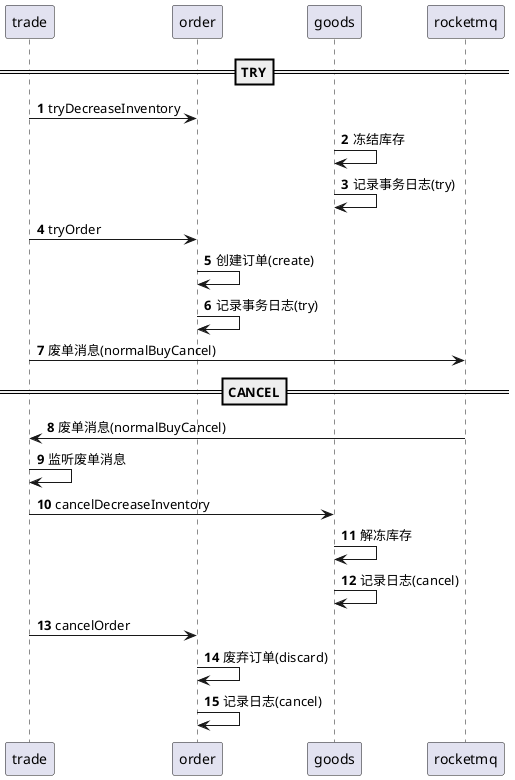

### 为什么要区分普通交易和秒杀交易?

首先, 我认为是场景不同, 一个是低流量的场景, 用户关注的是买得稳, 核心在成功率和一致性. 一个是高并发大流量的场景, 用户关注的是成功与否, 买得快, 及时给用户响应, 核心在于快速响应.

### 那在你的项目中是如何实现普通交易的, 他和秒杀交易有什么区别?

最简单的区别就是由于秒杀交易的流量很大, 我们在很多一步一步的优化中都将很多耗时的步骤放到了异步中去, 这其实也导致了我们其他的一些服务的改变, 比如订单号的生成, 我们原本是放到订单服务中去的, 但是由于把订单的生成放到异步条件中了, 但是前端又是根据订单号来轮询, 所以如果放到订单服务中去生成的话就很难受, 我们就放到交易模块去生成了, 先去生成订单号, 这样前端才能收到订单号然后去轮询, 这里又涉及到一个东西, 如果这么写的话, 我们的项目中会出现很多地方去生成订单号, 假如说我们的订单号生成逻辑有问题, 很不好修改, 假设以后又在其他模块去生成订单号, 不又得写一遍, 出了问题还得一个一个慢慢改, 所以我们创建了一个order-client, 这个订单客户端中干的事情就是生成订单号, 然后每个模块中去依赖他去生成订单号, 这样就不会出现这些问题了, 另一个好处就是, 如果一直放到order模块中的话, 每次trade模块调用的时候就会去进行一次对订单模块的远程调用, 在秒杀场景下, 又会造成一次性能损耗, 我认为这是不能被允许的, 所以直接通过jar包的形式放到每一个依赖里去生成. 上面只是说了一些秒杀交易的东西, 那么普通交易就考虑的不是即使返回了, 而是在于订单是否生成了, 不能说成功了以后订单还没有生成, 肯定体验也不好, 然后因为交易设计多个模块的数据一致性, 比如说订单的推进, 库存的扣减, 所以这里我们引用了分布式事务. 

### 能给我介绍一下普通交易的流程吗

> 这么长, 这么多的点, 我该如何说起呢? 光是现在梳理起来, 靠着一个点一直说感觉能说一个小时, 但是我不可能给面试官介绍的时候感觉我很懂, 但是说不清的感觉, 要让面试官也能听懂, 这样才是最加分的.

我们在这里选择的是TCC的分布式事务, 但是我们并没有选择一个Seata的分布式事务, 而是自己实现了一下, Seata的分布式事务使用的话, 我记得是基于三个注解来指定方法来写的, 然后并没有解决空回滚和空悬挂的问题, 但是看有的文章说最新版本的seata已经解决了,一个原因是Seata实现的TCC分布式事务如果confirm失败了, 他会直接执行cancel, 但是我认为, 如果你try都能成功的话, confirm成功的概率还是很大的, 所以我们引入了重试机制, 如果confirm没有成功的话, 我们让他重试三次, 然后如果真的成功不了的话, 再进入cancel的流程. cancel的话我们是把他放到了MQ的异步链路上, 利用MQ的重投机制来让保证cancel的执行, 然后投递的消息这里我们是借鉴了网上一个方案的执行, 有一个疑似废单消息, 我们会延迟一分钟发送这个消息, 然后去检查订单是否创建成功, 如果创建成功了, 就证明他真的成功了, 走成功的流程, 如果没有的话, 就认为他失败了, 关于这个疑似废单消息, 他的思想其实是和confirm的重试机制一样的, 都是基于我认为成功的可能性很大, 然后想让他尽可能的走成功的链路来设置的一款方案.  try失败是废单消息, cancel失败是疑似废单消息.

---

接下来的是正确的回答格式, 上面主要是比较符合我的说话流程(类似于深搜), 所以就保留.

我的普通交易是自己设计了一个TCC的分布式事务, 因为Seata的分布式事务没有重试机制, 而且听说老版本的seata没有解决tcc的空悬挂和空回滚问题.

也就是将整个流程分成了try-confirm-cancel, 三个步骤, try主要是生成一个订单, 这个状态下, 用户是不可见的, 订单的状态是create, 然后冻结库存.

### 既然你说不用redis也可以，那么你使用redis的原因是什么呢

这里使用redis的原因还是基于流量考虑的, 一个是因为害怕他流量因为一些原因突然增大, 压垮数据库, 另一个是如果我在redis中也进行存储的话, 我想要转为热点商品也是可以的, 如果不存redis, 后续转热点商品会有点麻烦

